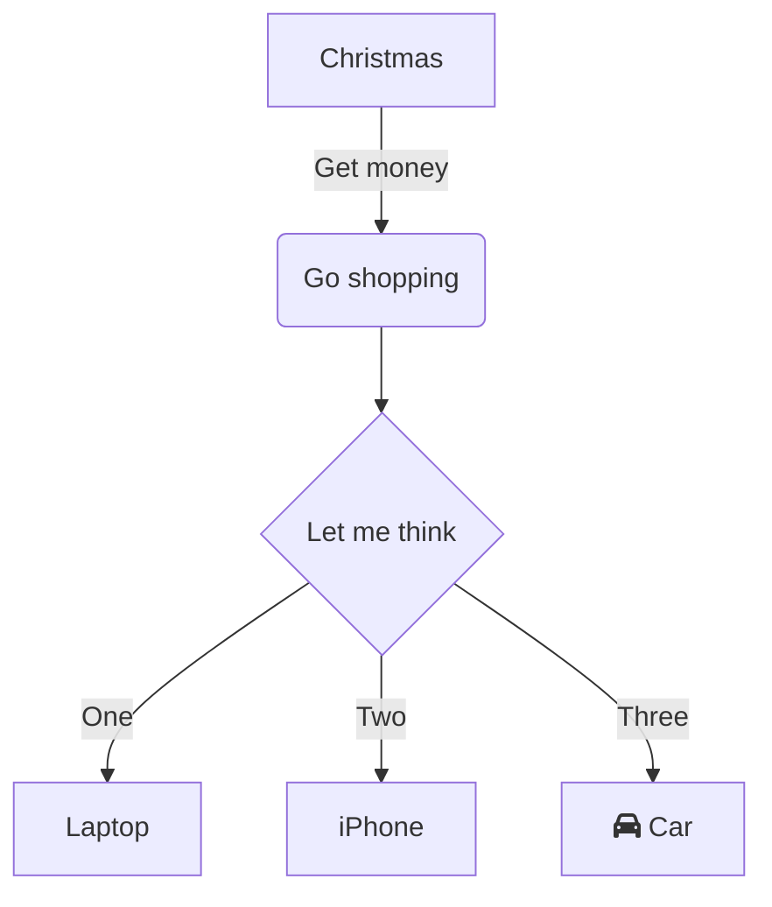

- [1. 💡What is Markdown](#1-what-is-markdown)
- [2. 💡Plugin in VScode use to write Markdown](#2-plugin-in-vscode-use-to-write-markdown)
- [3. 💡Header](#3-header)
- [4. 💡Formatting](#4-formatting)
- [5. 💡Table](#5-table)
- [6. 💡Code style](#6-code-style)
- [7. 💡 Image](#7--image)
- [8. 💡 Draw a chart](#8--draw-a-chart)
    - [8.1. Marmaid](#81-marmaid)
    - [8.2. PlantUML](#82-plantuml)
- [9. 💡 Math formula](#9--math-formula)
- [10. 💡 Import file](#10--import-file)


## 1. 💡What is Markdown
https://en.wikipedia.org/wiki/Markdown
## 2. 💡Plugin in VScode use to write Markdown 
- Markdown All in One 
- Markdown Preview Enchance 
## 3. 💡Header
Use `#` signs to represent the corresponding header tag
For example:
`#### h5:`

## 4. 💡Formatting
- Use `***` to Bold text 
Example:`**Bold text** :` **Bold text** 
- Use `*` to Italicize text 
Example:`*Italicize text*:`*Italicize text*
- Use `~~` to Strikethrough text 
Example: `~~Strikethrough text ~~:` 
~~Strikethrough text~~
- Use `>` to write Quotation 
Example: `>This is Quotation:`
>This is Quotation
- Use ` `` ` to Emphasize
Example: This is `text`   
## 5. 💡Table
- Use `Ctrl + Shift + p` or `F1` to find `Markdown Preview Enchance: Insert Table` to insert a table
  
| #   | Title 1                  |                  Title 2 |
| --- | :----------------------- | -----------------------: |
| 1   | This content video viral | This content video viral |
| 2   | This content video viral | This content video viral |
| 3   | This content video viral | This content video viral |
| 4   | This content video viral | This content video viral |
| 5   | This content video viral | This content video viral |
| 6   | This content video viral | This content video viral |
| 7   | This content video viral | This content video viral |

Note: Use `Alt + Shift + F` to Format Table
Note: The `:` mark is used for alignment
## 6. 💡Code style 
- Use ` ``` ` to format code style 
Example: 
```Python
print("Hello Word")
```
```C++
cout<<("Hello Word")
```
## 7. 💡 Image 
- Use syntax `` to import an image
Example: 
`: `
## 8. 💡 Draw a chart
#### 8.1. Marmaid
- Use `mermaid` combine ` ``` ` to draw a chart equal source code chart 
Example:` ```mermaid 
graph TD
    A[Christmas] -->|Get money| B(Go shopping)
    B --> C{Let me think}
    C -->|One| D[Laptop]
    C -->|Two| E[iPhone]
    C -->|Three| F[fa:fa-car Car] ```,: `

#### 8.2. PlantUML
- Use `plantuml` combine ` ``` ` to draw a chart equal source code chart
Example: Similar to mermaid, just different source code and syntax
## 9. 💡 Math formula
- Use `$` to write math formula
Example: `$y= x^2$: `$y= x^2$
## 10. 💡 Import file
- Use `@import` to import a file
Example: `@import "index.html": `
@import "index.html" 


